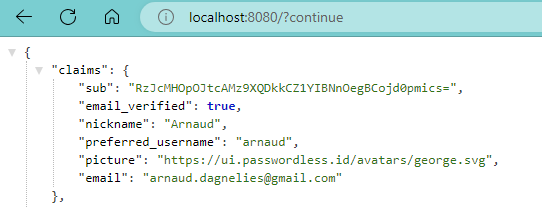

Passwordless.ID - Spring Boot Demo
==================================

This minimalistic repository shows how to use [Passwordless.ID](https://passwordless.id) to authenticate users.

## 1. Dependencies

Luckily, Spring Boot already has everything needed built-in, and adding a single dependency is enough.

```xml
<dependency>
    <groupId>org.springframework.boot</groupId>
    <artifactId>spring-boot-starter-oauth2-client</artifactId>
</dependency>
```

Adding this dependency will also add `spring-security` which will "protect" the whole web application by requiring the user to be authenticated to access anything.


## 2. OpenId providers configuration

First, in `resources/application.properties` (or ".yaml"), *Passwordless.ID* has to be declared as identity provider.

```properties
spring.security.oauth2.client.provider.passwordless.issuer-uri = https://api.passwordless.id
```

Then, also how to configure the authentication requests.

```properties
spring.security.oauth2.client.registration.passwordless.client-id = http://localhost:8080
spring.security.oauth2.client.registration.passwordless.scope = openid avatar email
```

The `client-id` **must be** the domain where the web application runs. As a security measure from Passwordless.ID, redirects to URLs outside your *client-id* domain will be denied. On the other hand, all redirect URLs within this domain will be allowed, without the need to register them beforehand. Also, `localhost` constitutes an exception: it is always allowed and does not require *https*.

The `scope` represents what you want to read from the user's profile and must be granted by the user. The scope `avatar` is a convinience scope specific to Passwordless.ID which encompasses the claims `nickname`, `picture` and `preferred_username`. It is more privacy oriented than the usual `profile` which contains the real name of the user and additional personal information.


## 3. Getting the user

Spring will do all the heavy lifting, and inject the OpenID Connect `user` obtained from Passwordless.ID.
It works out-of-the-box, without the need to add any code.

In our example, only a single controller is present the user information: `MyController.java`.

```java
import org.springframework.security.core.annotation.AuthenticationPrincipal;
import org.springframework.security.oauth2.core.oidc.OidcUserInfo;
import org.springframework.security.oauth2.core.oidc.user.OidcUser;
import org.springframework.web.bind.annotation.GetMapping;
import org.springframework.web.bind.annotation.RestController;

@RestController
public class MyController {

    @GetMapping("/")
    public OidcUserInfo getUserInfo(@AuthenticationPrincipal OidcUser user) {
        return user.getUserInfo();
    }
}
```

## 4. Try it out

Run the program, then open http://localhost:8080 . It should directly redirect to Passwordless.ID in order to authenticate you.
Once done, it will return to the original endpoint. It should display something like this:



---

## 5. Adjusting the security policies

By default, *all* endpoints are secured by Spring Security and require authentication beforehand.

Of course, it's possible to fine-tune which URLs require authentication, and which not, as well as many other things.
This is a minimalistic example though and explaining how Spring Security works and how it should be configured is beyond the scope of this tutorial.
For a good starting point, I recommend checking out this tutorial about [Spring Security and OpenID](https://www.baeldung.com/spring-security-openid-connect).

